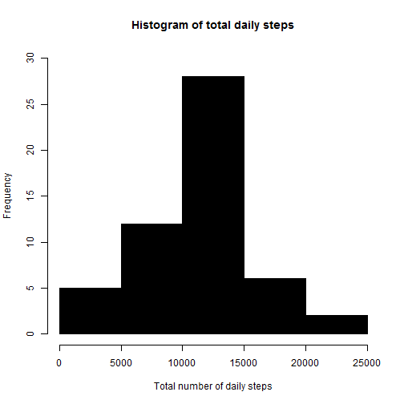
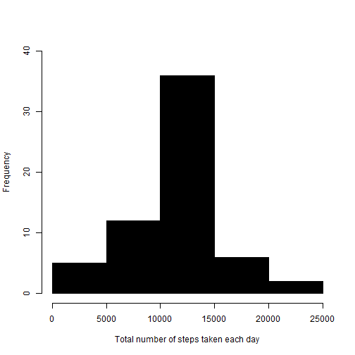

## Loading and preprocessing the data

Let큦 first load the data


```r
if(!file.exists('activity.csv')){
    unzip('activity.zip')
}
data <- read.csv('activity.csv')
```

A quick look at the data:


```r
str(data)
```

```
## 'data.frame':	17568 obs. of  3 variables:
##  $ steps   : int  NA NA NA NA NA NA NA NA NA NA ...
##  $ date    : Factor w/ 61 levels "2012-10-01","2012-10-02",..: 1 1 1 1 1 1 1 1 1 1 ...
##  $ interval: int  0 5 10 15 20 25 30 35 40 45 ...
```

I convert dates to a date data type:


```r
data$date<- as.Date(data$date)
str(data)
```

```
## 'data.frame':	17568 obs. of  3 variables:
##  $ steps   : int  NA NA NA NA NA NA NA NA NA NA ...
##  $ date    : Date, format: "2012-10-01" "2012-10-01" ...
##  $ interval: int  0 5 10 15 20 25 30 35 40 45 ...
```

## What is mean total number of steps taken per day?

1. Let큦 create a new data set omitting NAs, and then sum steps on a daily basis ("Calculate the total number of steps taken per day" is stored in dailysteps data frame below)


```r
data.no.na <- na.omit(data)
dailysteps<-rowsum(data.no.na,data.no.na$date)
```


2. "Make a histogram of the total number of steps taken each day"


```r
 hist(dailysteps$steps,main="Histogram of total daily steps", col="black",ylim=c(0,30),xlab="Total number of daily steps")
```



3. "Calculate and report the mean and median of the total number of steps taken per day"


```r
mean(dailysteps$steps)
```

```
## [1] 10766.19
```

```r
median(dailysteps$steps)
```

```
## [1] 10765
```

## What is the average daily activity pattern?

I will first aggregate the mean steps for each 5-minute interval over a 24 hr period (from the data set that excluded all NA values)


```r
library(dplyr)
```

```
## 
## Attaching package: 'dplyr'
```

```
## The following objects are masked from 'package:stats':
## 
##     filter, lag
```

```
## The following objects are masked from 'package:base':
## 
##     intersect, setdiff, setequal, union
```

```r
byInterval<-group_by(data.no.na,interval)
stepsmean<-summarize(byInterval,avgSteps=mean(steps))
```

With this result I can proceed to "1. Make a time series plot (i.e. type = "l") of the 5-minute interval (x-axis) and the average number of steps taken, averaged across all days (y-axis)"


```r
library(ggplot2)
ggplot(data = stepsmean, aes(x = interval, y = avgSteps)) + geom_line() + xlab("5-minute interval") + 
    ylab("average number of steps taken")
```


Now,let큦 answer "2. Which 5-minute interval, on average across all the days in the dataset, contains the maximum number of steps? 


```r
stepsmean[which.max(stepsmean$avgSteps), ]
```

```
## Source: local data frame [1 x 2]
## 
##   interval avgSteps
##      (int)    (dbl)
## 1      835 206.1698
```


## Imputing missing values

Note that there are a number of days/intervals where there are missing values (coded as NA). The presence of missing days may introduce bias into some calculations or summaries of the data.

1. "Calculate and report the total number of missing values in the dataset (i.e. the total number of rows with NAs)"


```r
missingval<-is.na(data$steps)
table(missingval)
```

```
## missingval
## FALSE  TRUE 
## 15264  2304
```

So there are 2304 rows with NAs

By the way, another way to see this is taking the data.no.na dataset computed at the begining of this presentation and examining it as follows:


```r
str(data.no.na)
```

```
## 'data.frame':	15264 obs. of  3 variables:
##  $ steps   : int  0 0 0 0 0 0 0 0 0 0 ...
##  $ date    : Date, format: "2012-10-02" "2012-10-02" ...
##  $ interval: int  0 5 10 15 20 25 30 35 40 45 ...
##  - attr(*, "na.action")=Class 'omit'  Named int [1:2304] 1 2 3 4 5 6 7 8 9 10 ...
##   .. ..- attr(*, "names")= chr [1:2304] "1" "2" "3" "4" ...
```

As it is seen, the "na.action"" produced a character vector of 2304 NA (i.e rows) (that eliminated 8 days of the original 61 becauses there was no data available for them)

2. "Devise a strategy for filling in all of the missing values in the dataset. The strategy does not need to be sophisticated. For example, you could use the mean/median for that day, or the mean for that 5-minute interval, etc."

I will use the stepsmean dataset already used (converted to a data frame first).

Then a function (named "decisionalgorithm") is developed to check if there are NAs and replace those where this condition is TRUE with the mean value for the corresponding 5-minute interval found in the stepsmean data frame (this is the replacement strategy/decision taken). 

The function is used over the original data set values to create a "completed" version in which all NAs have been replaced, hence fulfilling request #3 of the assignment ("Create a new dataset that is equal to the original dataset but with the missing data filled in.")


```r
stepsmean<-data.frame(stepsmean)
decisionalgorithm <- function(steps, interval) {
    
    
    if (!is.na(steps)) 
        value <- c(steps) 
    
        else 
          
        value <- (stepsmean[stepsmean$interval == interval, "avgSteps"])
        
    return(value)
}
completed.data <- data
completed.data$steps <- mapply(decisionalgorithm, completed.data$steps, completed.data$interval)
```

Let큦 proceed with point 4.
"Make a histogram of the total number of steps taken each day and Calculate and report the mean and median total number of steps taken per day."


```r
byDay<-group_by(completed.data,date)
totalsteps<-summarize(byDay,stepsperday=sum(steps))
str(totalsteps)
```

```
## Classes 'tbl_df', 'tbl' and 'data.frame':	61 obs. of  2 variables:
##  $ date       : Date, format: "2012-10-01" "2012-10-02" ...
##  $ stepsperday: num  10766 126 11352 12116 13294 ...
```

With totalsteps data set a histogram is produced:


```r
hist(totalsteps$stepsperday,main="", col="black",ylim=c(0,40),xlab="Total number of steps taken each day")
```



and 


```r
mean(totalsteps$stepsperday)
```

```
## [1] 10766.19
```

```r
median(totalsteps$stepsperday)
```

```
## [1] 10766.19
```

"Do these values differ from the estimates from the first part of the assignment?"
No, they are essentially the same (in the first part of the assignmen the na.omit removed eight full days that had no data whatsoever). In this part of the assignment we added data to those days that was identical for each of them and equal to the mean of the rest of the data for each 5-minute interval).

Note: the ommited days are those that belong to October and November, 2012, and do not figure in this list:


```r
unique(data.no.na$date)
```

```
##  [1] "2012-10-02" "2012-10-03" "2012-10-04" "2012-10-05" "2012-10-06"
##  [6] "2012-10-07" "2012-10-09" "2012-10-10" "2012-10-11" "2012-10-12"
## [11] "2012-10-13" "2012-10-14" "2012-10-15" "2012-10-16" "2012-10-17"
## [16] "2012-10-18" "2012-10-19" "2012-10-20" "2012-10-21" "2012-10-22"
## [21] "2012-10-23" "2012-10-24" "2012-10-25" "2012-10-26" "2012-10-27"
## [26] "2012-10-28" "2012-10-29" "2012-10-30" "2012-10-31" "2012-11-02"
## [31] "2012-11-03" "2012-11-05" "2012-11-06" "2012-11-07" "2012-11-08"
## [36] "2012-11-11" "2012-11-12" "2012-11-13" "2012-11-15" "2012-11-16"
## [41] "2012-11-17" "2012-11-18" "2012-11-19" "2012-11-20" "2012-11-21"
## [46] "2012-11-22" "2012-11-23" "2012-11-24" "2012-11-25" "2012-11-26"
## [51] "2012-11-27" "2012-11-28" "2012-11-29"
```

and are Oct. 1st,, Oct 8th, Nov. 1st, Nov. 4th, Nov. 9th, Nov. 10th, Nov. 14th and Nov. 30th. (you can inspect the original data set with Notepad++, for instance, and you will notice that those days contained only NA큦)

" What is the impact of imputing missing data on the estimates of the total daily number of steps?"
The histogram basically retains its shape. However, as it was expected, frequency counts increased in the 10,000 - 15,000 total steps/day range, since now the eigth days originally ommited were incorporated, each with a total number of steps in that range (and equal to:


```r
totalmeansteps<-sum(stepsmean$avgSteps)
totalmeansteps
```

```
## [1] 10766.19
```
)

This value shows, again, why adding the missing days with the mean data strategy used (that resulted in the completed.data data set) does not change mean and median values as compared to the first part of the assignment.

## Are there differences in activity patterns between weekdays and weekends?

For this part the weekdays() function is used to see if a given date (from the dataset with the filled-in missing values) is a weekday or a weekend .


```r
#I must use the Sys.setlocale to make sure that weekdays() returns days written in English (my computer is set to Spanish, and without this instruction no matches were found, and the weekday.or.weekend function produced wrong results, because weekdays() returned the days큡ames in Spanish -in my case. More information typing in R ?Sys.setlocale)
Sys.setlocale("LC_TIME","English_US")
```

```
## [1] "English_United States.1252"
```

```r
weekday.or.weekend <- function(date) {
    day <- weekdays(date)
    if (day %in% c("Monday", "Tuesday", "Wednesday", "Thursday", "Friday")) 
        
      return("weekday") 
        
    else
        
      return("weekend")
}

completed.data$date <- as.Date(completed.data$date)
completed.data$day <- sapply(completed.data$date, FUN = weekday.or.weekend)
completed.data$day<-as.factor(completed.data$day)
str(completed.data)
```

```
## 'data.frame':	17568 obs. of  4 variables:
##  $ steps   : num  1.717 0.3396 0.1321 0.1509 0.0755 ...
##  $ date    : Date, format: "2012-10-01" "2012-10-01" ...
##  $ interval: int  0 5 10 15 20 25 30 35 40 45 ...
##  $ day     : Factor w/ 2 levels "weekday","weekend": 1 1 1 1 1 1 1 1 1 1 ...
```
As seen, now the completed.data dataset contains a new factor variable  ("day") which takes two possible levels, "weekday" or "weekend".

Finally, let큦 "Make a panel plot containing a time series plot (i.e. type = "l") of the 5-minute interval (x-axis) and the average number of steps taken, averaged across all weekday days or weekend days (y-axis). "


```r
#Classify data based on weekday / weekend, and compute average steps per interval for each:

byWeekday<-group_by(completed.data,day,interval)
day.classified<-summarize(byWeekday,avgstepsperday=mean(steps))

#Plotting:

ggplot(day.classified, aes(interval, avgstepsperday)) + geom_line() + facet_grid(day ~ .) +
    xlab("5-minute interval") + ylab("Number of steps")
```


By looking at these graphs, the person the observations belong to seems to take more steps, on average, on weekdays early in the morning (at 8:35 is the maximun) than on weekends. However, average steps in weekends exceed those in weekday from, approximately, 10 AM to 5:30 PM. This seems to be a logical pattern for a "normal" individual (data and patterns depend on what you do as a work, and your personal preferences in free time). 

